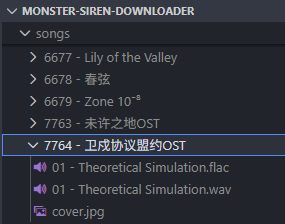
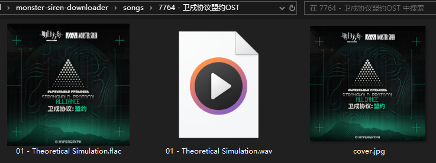

# monster-siren-downloader

塞壬唱片全量下载脚本

## 提供的功能

1. 从塞壬唱片官网获取所有专辑和歌曲的元数据，将它们的信息保存在 `metadata/` 目录下的 JSON 文件中
2. 并行下载所有歌曲，将下载的歌曲按照 `{album_id} - {album_name}/{track_number:02d} - {song_title}.{ext}` 的格式保存在 `songs/` 目录下
3. 将下载的歌曲转换为 FLAC 格式（如果源格式是 wav）
4. 将专辑封面保存为 `cover.jpg`，并将其嵌入到文件的元数据中

## Prerequisites

- Python 3.8+
- `ffmpeg` installed and available in your system PATH
- Install required Python packages:
```bash
pip install requests mutagen pydub
```

## Sample output

```powershell
# nemo @ nemo-g15-5511 in ~\Documents\Projects\py-playground\monster-siren-downloader
$ py .\script.py
INFO: Found 259 albums
INFO: Starting 1055 parallel downloads
...
INFO: Converting to FLAC: 01 - Theoretical Simulation.wav
...
INFO: Done. Albums: 259, Songs: 796
```

## Folder Structure

- `songs/` - Downloaded songs organized by album
    - `{album_id} - {album_name}/` - Directory for each album
        - `{track_number:02d} - {song_title}.{ext}` - Individual song files
        - `cover.jpg` - Album cover image
- `metadata/` - JSON metadata for albums and songs

### Sample downloaded album folders



### Sample album folder with album art

... if we have it, for wav files it's not shown in the Windows file explorer but it's there in the metadata.



## Why this?

打卫打的

怎么少前就不把音乐丢网上😡