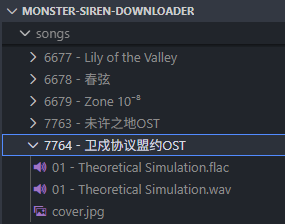
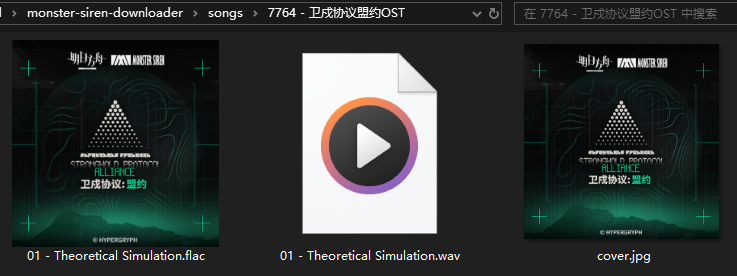

# monster-siren-downloader

塞壬唱片（明日方舟官方所提供的音乐）下载脚本

## 提供的功能

1. 从塞壬唱片官网获取所有专辑和歌曲的元数据，将它们的信息保存在 `metadata/` 目录下的 JSON 文件中 (`albums.json` 和 `songs.json`)
2. 并行下载所有歌曲，将下载的歌曲按照 `{album_id} - {album_name}/{track_number:02d} - {song_title}.{ext}` 的格式保存在 `songs/` 目录下
3. 将下载的歌曲转换为 FLAC 格式（如果源格式是 wav）
4. 将专辑封面保存为 `cover.jpg`，并将其嵌入到文件的元数据中

```powershell
# nemo @ nemo-g15-5511 in ~\Documents\Projects\py-playground\monster-siren-downloader
$ python .\script.py --help
usage: script.py [-h] {all,metadata,album} ...

Download music from Monster Siren (monster-siren.hypergryph.com).

positional arguments:
  {all,metadata,album}  Operation mode
    all                 Download everything (default)
    metadata            Download metadata only (no audio/images)
    album               Download a specific album

options:
  -h, --help            show this help message and exit
# nemo @ nemo-g15-5511 in ~\Documents\Projects\py-playground\monster-siren-downloader
$ python .\script.py album --help         
usage: script.py album [-h] query

positional arguments:
  query       Album name (substring match) or album cid

options:
  -h, --help  show this help message and exit
```


## Prerequisites

- Python 3.8+
- `ffmpeg` installed and available in your system PATH
- Install required Python packages:
```bash
pip install requests mutagen pydub
```

## Sample output

### ALL mode

```powershell
# nemo @ nemo-g15-5511 in ~\Documents\Projects\py-playground\monster-siren-downloader
$ py .\script.py
INFO: Found 259 albums
INFO: Starting 1055 parallel downloads
...
INFO: Converting to FLAC: 01 - Theoretical Simulation.wav
...
INFO: Done. Albums: 259, Songs: 796
```

### Metadata mode

```powershell
# nemo @ nemo-g15-5511 in ~\Documents\Projects\py-playground\monster-siren-downloader
$ python script.py metadata
INFO: Found 270 albums
INFO: Done. Albums: 270, Songs: 836
```

### Album mode

```powershell
# nemo @ nemo-g15-5511 in ~\Documents\Projects\py-playground\monster-siren-downloader
$ python script.py album 4508  
INFO: Found 270 albums
INFO: Matched album: 岁的界园志异OST
INFO: Starting 17 parallel downloads
INFO: Converting to FLAC: 01 - 界园志异.wav
INFO: Converting to FLAC: 02 - 自有乾坤.wav
INFO: Converting to FLAC: 03 - 盘桓千古.wav
INFO: Converting to FLAC: 04 - 枕景.wav
INFO: Converting to FLAC: 05 - 天不予.wav
INFO: Converting to FLAC: 06 - 逍遥难.wav
INFO: Converting to FLAC: 07 - 叙苍茫.wav
INFO: Converting to FLAC: 08 - 岁识气象.wav
INFO: Converting to FLAC: 09 - 巧筑八方.wav
INFO: Converting to FLAC: 10 - 残卷.wav
INFO: Converting to FLAC: 11 - 意难平.wav
INFO: Converting to FLAC: 12 - 意难平.wav
INFO: Converting to FLAC: 13 - 岁陵漫步.wav
INFO: Converting to FLAC: 14 - 守矩为义.wav
INFO: Converting to FLAC: 15 - 栖景室.wav
INFO: Converting to FLAC: 16 - 破晦.wav
INFO: Done. Albums: 1, Songs: 16
```

## Folder Structure

- `songs/` - Downloaded songs organized by album
    - `{album_id} - {album_name}/` - Directory for each album
        - `{track_number:02d} - {song_title}.{ext}` - Individual song files
        - `cover.jpg` - Album cover image
- `metadata/` - JSON metadata for albums and songs

### Sample downloaded album folders



### Sample album folder with album art

... if we have it, for wav files it's not shown in the Windows file explorer but it's there in the metadata.



## Why this?

打卫打的

怎么少前就不把音乐丢网上😡